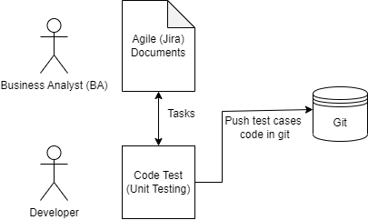
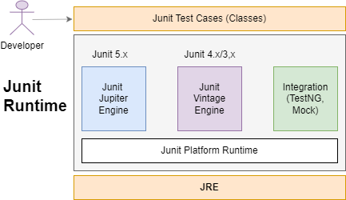

# JUnit with Mockito

> This note will have detailing of com.sl.mocktio package. The code written for test cases are being synched with this note


## Junit 5 with Mockito 3


### Unit testing
- Here unit indicates a part of a project which can be a task story.
- Once code is completed by developer, then that part must be tested

- Unit Testing = Testing once part project developed by programmer.
  Ex: EmployeeRegister
  
  

### Junit 5:
- Junit is a unit test framework. it is opensource java library.
- To test our code(class), we need to define one class that is called as Test case (Test class).

**To define one test case we should use**
- Junit 5 Annotations
- Junit 5 Assert AP

**Junit 5 Annotations**
- @Test
- @DisplayName
- @BeforeEach
- @AfterEach
- @BeforeAll
- @AfterAll
- @Disabled
- @TestMethodOrder
- @RepeatedTest
- @Tag
 
**Junit 5 Assert API**
- It has assert methods which says that test cases are passed or failed

**Here, Junit Runtime is provided with 3 components and one platform runtime.**
1. Junit Jupiter Engine ( _Junit 5 API_ ).
1. Junit Vintage Engine (  _Junit 4 and 4 APIs_ )
1. Integration ( _TestNG, Mock ... etc_ )

```
Note: For our test cases (Class + method) object creation and test-method calling done by Junit platform runtime. 
```

**Architecture of Junit and its internal implementation**



**Explaination**
- Junit Runtime is executed on the top of java.
- Junit Platform Runtime takes test cases classes and executes it on the top of JRE.
- Object creation and methods calling are done by Junit Platform Runtime.
- It has 3 components.
    - Junit Jupiter Engine: It is also called Junit 5
    - Junit Vintage Engine: It is 4.x/3.x junit which is older version.
    - Integration: Integration with other testing framework like TestNG, Mock and etc.


**Dependency**

```
<dependency>
	<groupId>org.junit.jupiter</groupId>
	<artifactId>junit-jupiter-engine</artifactId>
	<version>5.6.2</version>
	<scope>test</scope>
</dependency>
```

**1. @Test**

```
package com.junit_test;

import org.junit.jupiter.api.Test;

public class TestEmployee {
	
	@Test
	public void testSave() {
		System.out.println("Save-Test");
	}
	
	@Test
	public void testUpdate() {
		System.out.println("Update-Test");
	}

}
```

_Output:_ <br/>
Save-Test<br/>
Update-Test

<hr/>

**2. @TestMethodOrder** <br/>
We can define multiple test method inside testcase. Those are executed in Random order by default


a.<u>OrderAnnotation</u>
- We can specify our own order using @TestMethodOrder + OrderAnnotation.
- Here we need to provide @Order(Number)
- Order number is same there is no problem.	

```
@TestMethodOrder(OrderAnnotation.class)
public class TestEmployee {
	
	@Test
	@Order(4)
	public void testSave() {
		System.out.println("Save-Test");
	}
	
	@Test
	@Order(2)
	public void testUpdate() {
		System.out.println("Update-Test");
	}

}

```

b.<u>Alphanumeric</u>
- We can use @TestMethodOrder(Alphanumeric.class) for provide test method order.
- First sort using 0-9 if same found then compare wuth A-Z sorting order

```
@TestMethodOrder(Alphanumeric.class)
public class TestEmployee {
	
	@Test
	public void testSave() {
		System.out.println("Save-Test");
	}
	
	@Test
	public void test3Update() {
		System.out.println("Update-Test");
	}

	@Test
	public void testDelete() {
		System.out.println("Delete-Test");
	}
	
}

```

_Output:_ <br/>
Update-Test <br/>
Delete-Test <br/>
Save-Test <br/>

<hr/>


**3. @BeforeEach / @AfterEach / @BeforeAll / @AfterAll** <br/>
- @BeforeEach: To execute any logic once per test method before starting it.
- @AfterEach: To execute any logic once per test method after finishing it.
- @BeforeAll: To execute any logic once per test case before starting.
- @AfterAll: To execute any logic once per test case after finishing.

```

public class TestEmployee {

	@BeforeAll
	public static void setupOnce() {
		System.out.println("From-Setup Once");
	}
	
	@BeforeEach
	public void setup() {
		System.out.println("From-Setup");
	}
	
	@Test
	public void testSave() {
		System.out.println("Save-Test");
	}
	
	@Test
	public void testUpdate() {
		System.out.println("Update-Test");
	}
	
	@AfterEach
	public void clear() {
		System.out.println("Clear-Setup");
	}
	
	@AfterAll
	public static void clearOnce() {
		System.out.println("Clear-Setup Once");
	}
}

```

_Output:_ <br/>
From-Setup Once <br/>
From-Setup <br/>
Save-Test <br/>
Clear-Setup <br/> <br/>

From-Setup <br/> 
Update-Test <br/>
Clear-Setup <br/>
Clear-Setup Once <br/>

<hr/>

**4. @DisplayName:** <br/> 
This annotation is used to provide 'Readable Text' in place of actual method and class name at Junit Console.

```
@DisplayName("Testing Employee Task")
public class TestEmployee {

	
	@Test
	@DisplayName("Testing Save Method")
	public void testSave() {
		System.out.println("Save-Test");
	}
	
	@Test
	@DisplayName("Testing Update Method")
	public void testUpdate() {
		System.out.println("Update-Test");
	}
}

```

<hr/>

**5. @Disabled:** <br/> 
This annotation is used to specify ignore one test-method while executing test-case (do not execute test method)

```

@Test
	@DisplayName("Testing Save Method")
	public void testSave() {
		System.out.println("Save-Test");
	}
	
	@Test
	@Disabled
	@DisplayName("Testing Update Method")
	public void testUpdate() {
		System.out.println("Update-Test");
	}

```

```
Note: testUpdate() is temporarily disabled.

```

<hr/>

**6. @RepeatedTest:** <br/>
- To execute any test method multiple time (like batch processing)
- EX: Export 1-10 Records, 10-20 Records.

<hr/>

**7. TestInfo** <br/>
To know our test case details like classname, method name, display name, tag name etc. We can use once interface TestInfo

```

public class TestEmployee {

	@RepeatedTest(value =3, name = "{displayName} {currentRepetition}/{totalRepetitions}")
	@DisplayName("Multiple Task")
	public void testMultiple(TestInfo testInfo) {
		System.out.println("Hello "+testInfo.getTestClass().get().getName());
		System.out.println("DisHello: "+testInfo.getDisplayName());
	}
}

```

_Output:_ <br/>
Hello com.junit_test.TestEmployee <br/>
DisHello: Multiple Task 1/3 <br/>
Hello com.junit_test.TestEmployee <br/>
DisHello: Multiple Task 2/3 <br/>
Hello com.junit_test.TestEmployee <br/>
DisHello: Multiple Task 3/3 <br/>

<hr/>

**8. @Tag** <br/>
- These are used to filter test methods for execution in different environments.
- For example, i want to test export example in production env at same i want to test delete operation only in development environment then use tag concept and maven-surefire-plugin in pox.xml

```
<build>
	<pluginManagement>
		<plugins>
			<plugin>
				<groupId>org.apache.maven.plugins</groupId>
				<artifactId>maven-surefire-plugin</artifactId>
				<version>3.0.0-M5</version>
				<configuration>
					<!-- include tag -->
					<groups>Dev</groups>
					<!-- exclude tag -->
					<excludedGroups>Prod</excludedGroups>
				</configuration>
			</plugin>
		</plugins>
	</pluginManagement>
</build>

```

```

@Test
@Tag("Prod")
public void testA() {
	System.out.println("HELLO-TEST-A");
}

@Test
@Tag("Dev")
public void testB() {
	System.out.println("HELLO-TEST-B");
}

```

Junit-5 Session-2


Assert API:
- It is used to validate Test, IS CURRENT TEST PASS/FAIL ?
- Expected value is compared with Actual Result.


 


